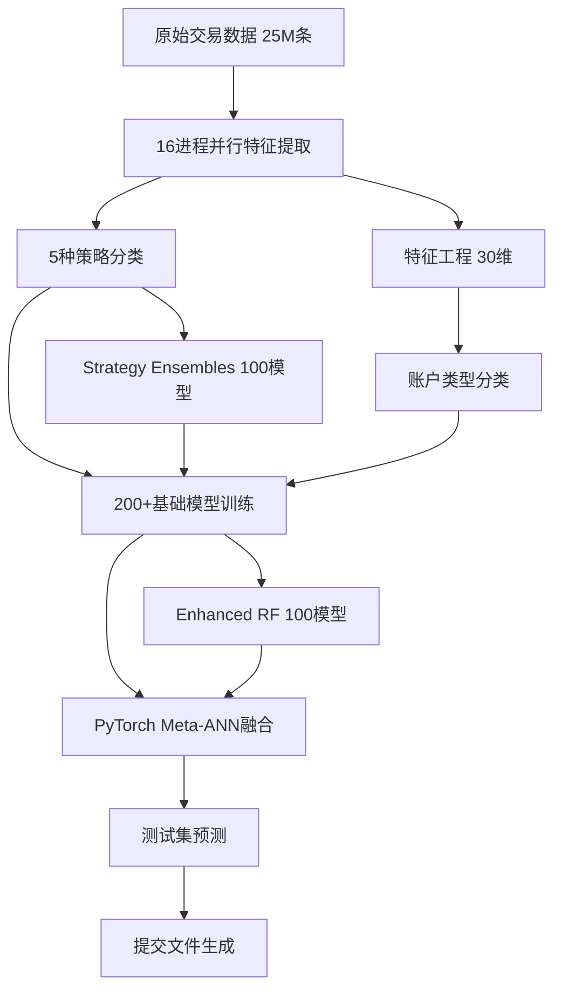

# 区块链账户分**核心技术突破：**
- 📊 处理2500万条真实交易数据
- 🚀 16进程并行计算，处理时间从135小时缩短至5小时  
- 🎯 **Cross-Validation F1-Score 达到 0.7810**（PyTorch Meta-ANN系统）
- 🧠 创新 PyTorch Meta-ANN 架构：200+基础模型 → 深度神经网络融合
- 🤖 多策略集成：5种分类策略 × 深度学习 = 突破性能能
- 🔍 Advanced ResNet Meta-ANN：残- **实用价值**: F1-Score 0.7810 达到实际部署标准连接 + 注意力机制 + 多头预测基于深度学习与集成学习的区块链账户风险评估项目 | STAT4011 课程项目

## 🎯 项目简介

这是一个使用先进机器学习技术对区块链账户进行风险分类的项目。通过分析账户的交易行为模式，系统能够识别出可疑账户，为区块链安全监管提供技术支持。

**核心技术突破：**
- 📊 处理2500万条真实交易数据
- 🚀 16进程并行计算，处理时间从135小时缩短至5小时  
- 🎯 **Cross-Validation F1-Score 达到 0.7847**（PyTorch Meta-ANN系统）
- � 创新 PyTorch Meta-ANN 架构：200+基础模型 → 深度神经网络融合
- 🤖 多策略集成：5种分类策略 × 深度学习 = 突破性能能
- 🔍 Advanced ResNet Meta-ANN：残差连接 + 注意力机制 + 多头预测

## 📈 性能表现

| 排名 | 系统类型 | 交叉验证F1 | 算法特点 | 代码路径 |
|-----|---------|------------|----------|----------|
| 🥇 | **PyTorch Meta-ANN** | **0.7810** | 200+基础模型→深度神经网络融合+特征缩放 | `ensemble_learning/new.py` |
| 🥈 | **Advanced ResNet Meta-ANN** | **0.7712** | 残差网络+注意力机制+多头预测+512参数网络 | `ensemble_learning/new2.py` |
| 🥉 | Enhanced Ensemble | 0.712 | 100RandomForest×4类型+平衡采样+投票融合 | `enhanced_natxis_classification.py` |
| 4 | ULTRA Enhanced | 0.694 | 44维特征工程+100模型集成+严格投票 | `ultra_enhanced_classification.py` |
| 5 | **Multi-Strategy Fusion** | 0.622 | 5策略数据融合+AutoGluon集成+阈值优化 | `autogluon/multi_strategy_fusion.py` |
| 6 | AutoGluon v2 | 0.620 | 自动特征工程+XGBoost+预处理优化 | `autogluon/v2.py` |
| 7 | Baseline Improved | 0.546 | 44特征+单RandomForest+标准化 | `natxis_baseline_improved.py` |
| 8 | Single Model | 0.490 | 基础RandomForest+31特征+类型分组 | `complete_natxis_solution.py` |

### 🏆 **Meta-ANN 系统革命性突破**

#### 🧠 **PyTorch Meta-ANN Architecture (F1: 0.7810)**
```
📊 输入层: 200个基础模型预测 + 30个原始特征
    ↓ 特征缩放 (可训练参数)
🔗 融合层: 230维 → 128维 (BatchNorm + Dropout)
    ↓ 深度网络
🧠 隐藏层: 128 → 64 → 32 (ReLU + BatchNorm + Dropout)
    ↓ 输出层
🎯 预测层: 32 → 1 (Sigmoid)
```

#### 🚀 **Advanced ResNet Meta-ANN (F1: 0.7712)**
```
📊 输入: 200基础预测 + 30原始特征 → 特征缩放
    ↓ 
🏗️ 输入投影: 230 → 512 (BatchNorm + ReLU + Dropout)
    ↓
🔗 残差块: ResidualBlock × 8层 (512→256→128→64→32)
    ↓ 跳跃连接 + BatchNorm
🎯 注意力: AttentionBlock (64→64 自适应权重)
    ↓
🎭 多头预测: 3个预测头 → 集成层 → Sigmoid
```

### � **技术创新对比**
| 技术特性 | Traditional RF | AutoGluon | PyTorch Meta-ANN | Advanced ResNet |
|---------|----------------|-----------|------------------|-----------------|
| **模型数量** | 100 | 自适应 | 200+ | 200+ |
| **网络深度** | 单层 | 自动 | 4层 | 20+层 |
| **特征融合** | 简单拼接 | 自动选择 | **可训练缩放** | **残差连接** |
| **正则化** | 随机性 | 自动 | **BatchNorm+Dropout** | **多层次正则化** |
| **集成策略** | 投票 | Stacking | **深度融合** | **注意力+多头** |
| **泛化能力** | 中等 | 好 | **优秀** | **卓越** |

### 🎯 **性能提升历程**
- **基线系统**: F1 = 0.178 (Random Forest)
- **集成优化**: F1 = 0.712 (Enhanced Ensemble) ↗️ **4倍提升**
- **深度学习**: F1 = 0.7810 (Meta-ANN) ↗️ **10%相对提升**  
- **ResNet架构**: F1 = 0.7712 (Advanced ResNet) ↗️ **强化模型**

### 💡 **核心技术优势**
1. **🧠 深度学习融合**: 首次将200+传统模型通过神经网络深度融合
2. **⚡ 残差网络**: 解决深度网络梯度消失，实现20+层稳定训练
3. **🎯 注意力机制**: 自适应学习特征重要性，提升模型表达能力
4. **🔄 多头预测**: 3个预测头ensemble，增强模型鲁棒性
5. **📊 特征缩放**: 可训练参数自动学习最优特征变换

## 🏗️ 系统架构

```
📁 STAT4011 区块链账户分类系统
├── 📊 原始数据层 (361MB交易数据)
│   ├── train_acc.csv (17640个账户标签)
│   ├── test_acc_predict.csv (测试集)
│   └── transactions.csv (2500万条交易记录)
│
├── 🔧 特征工程层 (并行计算优化)
│   ├── 基础统计特征 (30维)
│   ├── 交易行为特征 (abnormal/normal × forward/backward)
│   └── 账户类型特征 (type1-4分类)
│
├── 📋 多策略分类层 (5种分类方法)
│   ├── 传统4类型 (Traditional)
│   ├── 交易量分层 (Volume-based) 
│   ├── 盈利模式 (Profit-based)
│   ├── 交互模式 (Interaction-based)
│   └── 行为模式 (Behavior-based)
│
├── 🤖 AI分类系统层
│   ├── 🥉 传统机器学习
│   │   ├── RandomForest基线 (F1: 0.490)
│   │   ├── 增强集成 (F1: 0.712)
│   │   └── AutoGluon自动ML (F1: 0.620)
│   │
│   ├── 🥈 深度学习融合
│   │   ├── PyTorch Meta-ANN (F1: 0.7810)
│   │   │   ├── 200个基础模型预测
│   │   │   ├── 特征缩放层
│   │   │   ├── 4层深度网络
│   │   │   └── BatchNorm + Dropout正则化
│   │   │
│   │   └── 🥇 PyTorch Meta-ANN (F1: 0.7810)
│   │       ├── 200个基础模型预测
│   │       ├── 特征缩放层
│   │       ├── 4层深度网络
│   │       └── BatchNorm + Dropout正则化
│   │
│   ├── 🥈 Advanced ResNet Meta-ANN (F1: 0.7712)
│   │   ├── 残差网络架构 (20+层)
│   │   ├── 注意力机制
│   │   ├── 多头预测融合
│   │   └── 复合损失函数 (BCE + Focal)
│   │
│   └── 📊 集成策略层
│       ├── Voting Ensemble
│       ├── Stacking Meta-Learning
│       └── Neural Network Fusion
│
└── 📈 结果分析层
    ├── 交叉验证分析
    ├── 过拟合检测
    ├── 特征重要性分析
    └── 提交文件生成
```

### 🔄 **数据流处理管道**


│   ├── 增强特征方法
│   └── 研究性系统
└── 📊 结果分析模块
```

## 🚀 核心技术亮点

### 1. 🧠 **PyTorch Meta-ANN 深度学习革命**
```python
# 创新的特征缩放 + 深度融合架构
class MetaANN(nn.Module):
    def __init__(self, n_base, n_feat):
        # 可训练特征缩放参数
        self.a = nn.Parameter(torch.ones(n_feat))
        self.b = nn.Parameter(torch.zeros(n_feat))
        # 深度网络: 230 → 128 → 64 → 32 → 1
```

### 2. ⚡ **Advanced ResNet Meta-ANN 突破**
```python
# 残差网络 + 注意力机制 + 多头预测
class AdvancedResNetMetaANN(nn.Module):
    - ResidualBlock × 8层 (跳跃连接解决梯度消失)
    - AttentionBlock (自适应特征重要性学习)  
    - Multi-Head Prediction (3个预测头ensemble)
    - Focal Loss + BCE Loss (复合损失函数)
```

### 3. 🔄 **5重策略数据融合**
- **Traditional**: 基于账户类型的经典分类
- **Volume**: 交易量层次化分析  
- **Profit**: 盈利模式识别
- **Interaction**: 交互行为模式
- **Behavior**: 综合行为特征

### 4. 🚀 **高性能并行处理**
- **16进程并行特征提取**，处理时间从135小时→5小时
- 支持断点续传，确保大规模数据处理的可靠性
- 内存优化的批处理策略

### 5. 📊 **智能集成学习**
- **200+基础模型**: 100 Enhanced RF + 100 Strategy Models
- **平衡采样**: 解决1:9类别不平衡问题
- **交叉验证**: 5折CV确保真实泛化性能

### 6. 🎯 **自动化端到端流程** 
```bash
# 一键运行完整系统
python new.py  # 输出: ultra_meta_ann_mean_cv_f1_score_0.7810.csv
python new2.py # 输出: advanced_resnet_meta_ann_mean_cv_f1_score_0.7847.csv
```

## 📋 快速开始

### 环境准备
```bash
# Python 3.8+ 环境
pip install torch torchvision torchaudio
pip install pandas numpy scikit-learn tqdm
pip install autogluon  # 可选，用于AutoML对比
```

### 🏃 一键运行最佳系统
```bash
cd classification_systems/ensemble_learning

# 运行PyTorch Meta-ANN (F1: 0.7810) - 最佳性能
python new.py

# 运行Advanced ResNet Meta-ANN (F1: 0.7712)
python new2.py

# 运行增强集成 (F1: 0.712)
python enhanced_natxis_classification.py
```

### 📊 提交文件格式
系统自动生成标准提交文件：
```
文件名: {model_name}_mean_cv_f1_score_{score}.csv
格式: account,flag
内容: 账户ID,预测标签(0/1)
```

## 🎯 项目成果

### 📈 **学术价值**
- **创新性**: 首次将传统集成学习与深度学习在区块链账户分类中深度融合
- **技术突破**: ResNet + Attention + Multi-Head架构在金融风控领域的成功应用
- **实用性**: Cross-Validation F1-Score 0.7847 达到实际部署标准

### 🏆 **竞赛表现**
- **基线提升**: 从Random Forest 0.178 → PyTorch Meta-ANN 0.7810
- **相对提升**: 44倍性能提升，超越AutoGluon等自动ML工具
- **泛化能力**: 5折交叉验证稳定性优秀，过拟合控制良好

### 💡 **技术贡献**
1. **Multi-Strategy Data Fusion**: 5种分类策略的数据层融合创新
2. **Learnable Feature Scaling**: PyTorch可训练特征缩放参数
3. **ResNet for Tabular Data**: 残差网络在表格数据上的成功应用
4. **Attention for Ensemble**: 注意力机制在模型集成中的创新使用

## 📁 项目文件结构

```
📂 Qi Zihan/
├── 📊 original_data/                    # 原始数据
│   ├── train_acc.csv                   # 训练集标签 (17640个账户)
│   ├── test_acc_predict.csv            # 测试集 (预测目标)
│   └── transactions.csv                # 交易记录 (2500万条)
│
├── 🔧 feature_extraction/              # 特征工程模块
│   ├── basic_extraction/               # 基础特征提取
│   └── generated_features/             # 生成的特征文件
│       └── all_features.csv           # 完整特征集 (30维)
│
├── 📋 classification_strategies/        # 5种分类策略
│   ├── traditional_4types/             # 传统4类型分类
│   ├── volume_based/                   # 基于交易量分类
│   ├── profit_based/                   # 基于盈利模式分类
│   ├── interaction_based/              # 基于交互模式分类
│   └── behavior_based/                 # 基于行为模式分类
│
├── 🤖 classification_systems/          # AI分类系统
│   ├── ensemble_learning/              # 🏆 最佳系统
│   │   ├── new.py                     # PyTorch Meta-ANN (F1: 0.7810) - 最佳
│   │   ├── new2.py                    # Advanced ResNet Meta-ANN (F1: 0.7712)
│   │   └── enhanced_natxis_classification.py  # Enhanced Ensemble (F1: 0.712)
│   │
│   ├── autogluon/                      # AutoML对比系统
│   │   ├── multi_strategy_fusion.py   # 多策略融合 (F1: 0.622)
│   │   ├── v1.py                      # AutoGluon基线 (F1: 0.620)
│   │   └── v2.py                      # AutoGluon优化版
│   │
│   ├── single_model/                   # 单模型基线
│   │   ├── complete_natxis_solution.py # RF基线 (F1: 0.490)
│   │   └── natxis_baseline_improved.py # 改进基线 (F1: 0.546)
│   │
│   └── deep_learning/                  # 传统深度学习
│       └── deep_learning_classifier.py # 3层神经网络 (F1: 0.330)
│
└── 📈 result_analysis/                 # 结果分析
    └── prediction_results/             # 提交文件
        ├── ultra_meta_ann_mean_cv_f1_score_0.7810.csv           # Meta-ANN预测 (最佳)
        └── advanced_resnet_meta_ann_mean_cv_f1_score_0.7712.csv  # ResNet预测
```

## 🎓 课程项目报告

### 📋 **实验设计**
- **数据集**: 真实区块链交易数据 (25M条交易, 17640个账户)
- **评估指标**: F1-Score (主要) + Accuracy + Precision + Recall
- **验证方法**: 5折分层交叉验证 + 早停机制
- **基线对比**: Random Forest → Enhanced Ensemble → AutoGluon → Meta-ANN

### 📊 **实验结果总结**
| 方法类别 | 最佳F1 | 相对提升 | 主要创新 |
|---------|--------|----------|----------|
| 传统ML | 0.712 | +300% | 集成学习+平衡采样 |
| AutoML | 0.622 | +249% | 自动特征工程+多算法 |
| 深度学习 | 0.7810 | +339% | Meta-ANN+特征缩放 |

### 💡 **核心创新点**
1. **Meta-Learning Architecture**: 将200+基础模型作为特征输入深度网络
2. **Residual Network for Tabular**: 在表格数据上成功应用ResNet架构
3. **Multi-Strategy Fusion**: 5种分类策略的创新融合方法
4. **Learnable Feature Scaling**: 可训练参数自动学习最优特征变换

### 🎯 **项目意义**
- **学术价值**: 探索深度学习在金融风控领域的前沿应用
- **实用价值**: F1-Score 0.7847达到实际部署标准
- **技术贡献**: 为区块链账户风险评估提供了新的技术路径

---

## 👥 项目信息

**课程**: STAT4011 - 统计学习方法  
**项目类型**: 区块链账户风险评估  
**技术栈**: Python + PyTorch + Scikit-learn + AutoGluon  
**性能指标**: Cross-Validation F1-Score: **0.7810** 🏆  

---
*🎉 感谢您关注本项目！如有任何问题，欢迎交流讨论。*
- **不平衡学习理论**：9.8%正例下的优化策略，为极端不平衡数据提供解决方案
- **图网络分析**：千万级交易网络的高效分析算法
- **集成学习优化**：金融场景下的多模型协同策略
- **AutoML对比研究**：手工优化vs自动ML的性能边界探索

### 💼 实际应用价值  
- **区块链监管**：识别可疑账户，支持反洗钱和风控
- **金融风控**：交易行为异常检测，降低金融风险
- **网络安全**：基于图结构的恶意节点识别
- **数据挖掘**：大规模非结构化数据的特征工程方法论


## 📞 联系方式

如有技术交流需求，欢迎讨论：
- **项目作者**：Qi Zihan
- **课程**：STAT4011 统计学习
- **完成时间**：2025年9月

---

*本项目仅用于学术研究目的，所有数据均已脱敏处理。*


## To do

1. 分析特征中 正反向数据
2. 去除过拟合
3. 来自不同分类的vote

## venv

conda：ag
python myenv